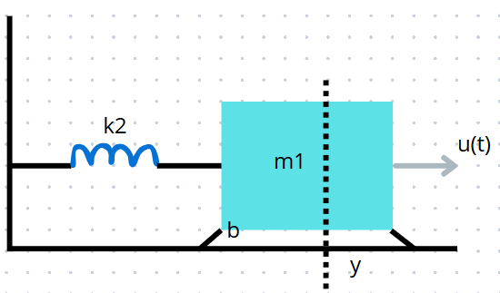
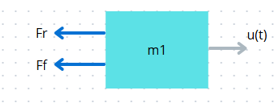
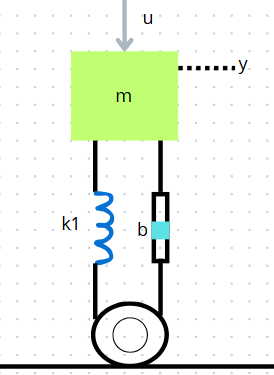
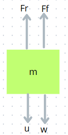

# Modelamiento de sistemas mecánicos
### Nestor Alexander Avila Rojas, Leslie Stephania Rodriguez Marín
## 1. Introducción
En el estudio de la dinámica de sistemas mecánicos, las leyes de Newton y las ecuaciones diferenciales son herramientas fundamentales para describir y predecir el comportamiento de cuerpos en movimiento. En esta clase, se exploró cómo aplicar las leyes de Newton (especialmente la segunda ley, $F=m*A$ para obtener ecuaciones diferenciales que modelen estos  sistemas mecánicos. Estas ecuaciones, una vez resueltas, nos dan información valiosa sobre la respuesta temporal del sistema, su estabilidad y su comportamiento bajo diferentes condiciones.
## 2. Modelamiento de sistemas
Todo fenómeno físico ya sea mecánico, eléctrico, hidráulico o combinaciones entre ellos puede tener un modelamiento que se puede expresar a partir de una ED. Dependiendo de la naturaleza del sistema, el modelamiento de un sistema permite analizar el comportamiento del mismo; lo más importante es el análisis, empezando por conocer la entrada y la salida del sistema a estudiar.
## 3. Sistemas mecánicos
>🔑​Un sistema mecánico es un conjunto de componentes físicos interconectados cuya función principal es transformar o transmitir movimiento y fuerza desde una fuente de energía hasta un punto de salida, permitiendo así la realización de un trabajo específico.
### 3.1 Sistema masa-resorte-amortiguador

>🔑Un sistema masa-resorte-amortiguador es un modelo mecánico fundamental que describe cómo una masa se mueve bajo la influencia de fuerzas elásticas y de amortiguamiento.

Este sistema es un modelo clásico en la mecánica que describe el comportamiento de un objeto (masa) que esta sujeto a la acción de un resorte y un amortiguador. Este sistema es fundamental para entender para entender como las fuerzas afectan el movimiento de objetos y como se disipa la energía en sistemas reales.

### 3.2 Componentes principales

#### Masa(m):
  >🔑 Representa el objeto que se mueve bajo la influencia de las fuerzas del resorte y el amortiguador.
#### Resorte(k):
>🔑 Elemento que hace que la energía se almacene y trata de volver a su estado natural aplicando una fuerza proporcional a la deformacion del resorte

Según ley de hooke, esta fuerza tiende a devolver la masa a su poscición de equilibrio. La constante del resorte mide la rigidez del mismo.

$$F_R = kx = k(x_1-x_2)$$

Donde:

k = Constante de elasticidad del resorte

x = Posición

En el transcurso de la asignatura, se asumirá que los resortes son lineales, es decir que la fuerza externa aplicada y el desplazamiento están relacionados por una constante de proporcionalidad $$k$$.
#### Amortiguador(B):
  >🔑Representa la ressitencia que disipa energia, mediante frición; su función es reducir la velocidad del sistema respecto tiempo.

La fuerza de amortiguamiento es proporcional a la velocidad de la masa, se debe saber la velocidad relativa del émbolo como y la carcasa.

$$F_F = b*\dot{x} = b(\dot{x_1}-\dot{x_2})$$

Donde:

b =  Constante de fricción viscosa

$\dot{x}$= Velocidad relativa
#### Fuerza externa F(t):
>🔑Es cualquier fuerza que se apliquye desde el exterior, como una fuerza constante o periodica. 

### 3.3 Ecuacion del movimiento

La dinámica del sistema se describe mediante una ecuación diferencial de segundo orden $m\ddot{x}(t) + b\dot{x}(t) + kx = F(t)\$ 

## 4. Tipos de fricción

En un sistema mecánico se dan diferentes tipos de fricción que serán explicados brevemente a continuación:
### 4.1 Fricción estática
>🔑 Es la fuerza que debe vencerse para iniciar el movimiento. Ocurre cuando dos superficies están en contacto pero no hay movimiento relativo entre ellas.
### 4.2 Fricción por deslizamiento
>🔑 Actúa cuando dos superficies se mueven una sobre la otra (deslizamiento).Su magnitud es generalmente menor que la fricción estática.
### 4.3 Fricción por rodamiento
>🔑 Se produce cuando una masa rueda sobre una superficie (ej: ruedas, rodamientos).Es mucho menor que la fricción por deslizamiento, reduciendo el desgaste y la energía necesaria para el movimiento.
## 5. Ejemplo
#### 💡Ejemplo 1
Determinar el modelo del sistema teniendo en cuenta que la entrada es u(t) y la salida es y(posición):

Figura 1: Ejemplo 1

DCL de masa 1:

Figura 2: DCL de masa

En este caso, no se tiene en cuenta la fuerza del peso, pues, el movimiento es horizontal. La sumatoria de fuerzas quedaría de la siguiente manera:

$$u(t)-F_R-F_F= m * a $$

Sabiendo que:

$$F_R= k_2*y(t)$$

$$F_F= k_1 * \dot{y}$$

El modelo del sistema sería:

$$u(t)-k_2 * y(t) - k_1 * \dot{y} = m * \ddot{y}$$
#### 💡Ejemplo 2
Encontrar el modelo matemático para el sistema que representa la sispensión de un automóvil:

Figura 3: Ejemplo 2

DCL de masa:

Figura 4: DCL de masa

Se debe tener en cuenta que no hay normal, ya que la masa no está en una superficie donde repose la fuerza, además, la fricción del rodamiento no se toma, porque no hay un movimiento horizontal. La sumatoria de fuerzas se evidencia a continuación:

$$u(t)+w-F_R-F_F=ma$$

Entonces el modelamiento matemático sería:

$$u(t)+mg-k_2*y(t)-k_1\dot{y}=m\ddot{y}$$
## 6. Sistemas Acoplados 

>🔑Los sistemas acoplados son aquellos en los que dos o más sistemas interactúan entre sí, influyendo mutuamente en su comportamiento. Estos sitemas están conectados de tal forma que el movimiento o la dinámica de un sistema afecta directamente al otro, lo que genera una relación interdependiente.

### 6.1 Caracteristicas de los sistemas acoplados
- **Interacción:** los sistemas no son independientes, las variables que describen uno de los sitemas influyen en las variables del otro.
- **Ecuaciones interrelacionadas:** Las ecuaciones que describen cada sistema están vinculadas. es decir, las ecuaciones diferenciales o algebraicas de un sistema contienen términos que dependen de las variables del otro sistema.
- **Transferencia de energía:** Existe una transferencia de energia, fuerza o información entre los sistemas. esto puede ser a través de fuerzas físicas (como una conexión elástica o un amortiguador) o señales de otro tipo.

### 6.2 Ecuaciones en sistemas acoplados 
Las ecuaciones diferenciales que describren estos sistemas suelen ser de la forma:

$m_1\ddot{x_1} + d_1\dot{x_1} + k_1x_1 - k_2(x_2-x_1) = F_1(t)\$ 

$m_2\ddot{x_2} + d_2\dot{x_2} + k_2(x_2-x_1) = F_2(t)\$ 

aqui $x_1$ y $x_2$ representan el desplazamiento de cada masa, $k_2$ es la cosnstante del resorte que conecta las dos masas, y $f_1(t)$ y $f_2(t)$ son las fuerzas externas aplicadas a cada masa. Las ecuaciones estan interconectadas por que el movimiento de una masa afecta directamente a la otra.

## 7. 📚Ejercicios
#### 📚Ejercicio 1

Obtener las ecuaciones diferenciales del siguiente sistema 

Figura 5: Ejercicio 1

Se procede a realizar el diagrama de fuerzas para cada masa (Diagrama de cuerpo libre)

Para masa 2:

Figura 6: DCL M2

$$fb+fk-ff=0$$
$$b(\dot{y_2(t)} - \dot{y_1(t)}) + k(y_2(t) - y_1(t))= 0$$
$$b(\dot{y_2(t)} - \dot{y_1(t)}) + k(y_2(t) - y_1(t))= m*a$$

Donde a = $\frac{d^2y(t)}{dt^2}$ que tambien se puede respresentar como $\ddot{y}$

Teniendo eso en cuenta, tenemos:

$$b(\dot{y_2(t)} - \dot{y_1(t)}) + k(y_2(t) - y_1(t))= = m_2*\ddot{y}$$

Para masa 1:

Figura 7: DCL M1

$$f(t)-fk-fb=0$$
$$f(t)- b(\dot{y_1(t)} - \dot{y_2(t)}) - k(y_1(t) - y_2(t)) = m_1*\ddot{y}$$

Las ecuaciones que modelan el sistema son:

$$b(\dot{y_2(t)} - \dot{y_1(t)}) + k(y_2(t) - y_1(t))= = m_2*\ddot{y}$$
$$f(t)- b(\dot{y_1(t)} - \dot{y_2(t)}) - k(y_1(t) - y_2(t)) = m_1*\ddot{y}$$

## 8. Conclusiones

El análisis detallado de un sistema mecánico es esencial para comprender cómo interactúan las fuerzas dentro de él. Aunque las ecuaciones diferenciales permiten modelar su comportamiento dinámico, sin una comprensión clara de las entradas, salidas y tipos de fricción presentes, el modelo pierde utilidad práctica. Modelar sistemas mecánicos va más allá de resolver ecuaciones; requiere identificar correctamente las variables de entrada y salida, así como las fuerzas y fricciones que afectan al sistema. Sin este análisis previo, cualquier representación matemática carecerá de valor para predecir el comportamiento real del sistema.

## 9. Referencias
Universidad Nacional Autónoma de México. (2018). Modelado de sistemas mecánicos. Facultad de Estudios Superiores Cuautitlán. Recuperado el 3 de mayo de 2025, de https://masam.cuautitlan.unam.mx/dycme/dsf/modelo-mecanicos

Ogata, Katsuhiko (1987) : Dinámica de Sistemas, Traducido de la primera edición en inglés de la obra System Dynamics, Prentice Hall Hispanoamericana, S.A., México.

Jorge Eduardo Cote Ballesteros. (2024). Sistemas mecánicos I. ETITC
