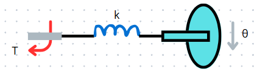
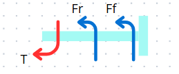

# Modelamiento de sistemas mecánicos 2
### Nestor Alexander Avila Rojas, Leslie Stephania Rodriguez Marín
## 1. Introducción
En el estudio de los sistemas dinámicos, el modelamiento de sistemas rotacionales desempeña un papel fundamental, ya que permite representar y analizar el comportamiento de mecanismos presentes en una amplia variedad de aplicaciones industriales y tecnológicas. 

Durante esta clase se abordó la importancia de identificar elementos presentes en otro tipo de sistemas mecánicos. También se exploraron métodos alternativos de modelado a partir del análisis de trabajo, energía y potencia. Si bien este enfoque puede ser útil para sistemas simples, su aplicación en sistemas complejos resulta limitada debido a la dificultad para gestionar múltiples variables e interacciones.

Finalmente, se introdujeron conceptos clave relacionados con mecanismos de transmisión como engranajes, palancas y bandas, los cuales permiten transformar y transferir el movimiento en un sistema mecánico. Estos elementos, al igual que las fuerzas involucradas, deben ser cuidadosamente considerados en el proceso de modelado para lograr representaciones precisas y útiles del comportamiento dinámico del sistema.

## 2. Sistemas Rotacionales
>🔑Los sistemas rotacionales son otro tipo de sistemas mecánicos, sólo que en este caso lo que varia es la fuerza aplicada ya que es un movimiento circular que nos genera un torque, estos sistemas se analizan usando las leyes del movimiento rotacional, que tienen cierta analogía con respecto a las del movimiento traslacional.

Figura 1: Movimiento rotacional

Para el análisis de estos sistemas usaremos leyes comparables al movimiento lineal tales como la fuerza de rozamiento donde el ángulo $\varphi$ es el ángulo de torsión.

$$F_R = k*\varphi$$

Tambien tendremos la fuerza de fricción donde la $\frac{\mathrm{d}\varphi }{\mathrm{d} t}$ es la velocidad angular del sistema.

$$F_{f}=b*\frac{\mathrm{d}\varphi }{\mathrm{d} t}$$

Y por último el torque donde la constante $J$ es el momento de inercia del sistema: 

$$T=J*\frac{\partial \varphi ^2 }{\partial t^2}$$

De igual manera como se venía trabajando para los demás sistemas mecánicos este también lo anamizaremos por medio de un diagrama de cuerpo libre el cual nos quedara de la siguiente forma, ya con las fuerzas dibujadas para así generar la función correspondiente que modela el sistema.

### 💡Ejemplo 1:
Encuentre el modelo matemático de la figura teniendo en cuenta que la entrada es  T(t) y la salida es $\Theta (t)$:

Figura 2: Ejemplo 1

Figura 3: DCL carga

Una vez con esto podremos determinar la función teniendo en cuenta que $\sum T=J*\Theta$:

$$T-F_{R}-F_{F}=J*\Theta$$

Remplazando, se obtendría la función que modela el sistema:

$$T(t)-k\Theta (t)-b\dot{\Theta(t)}=J\ddot{\Theta (t) }$$

## 2.1 Conversión Movimiento Translacional-Rotacional
Se realizan mediante sistemas de transmisión. Estos sistemas cambian dirección y velocidad de torque.
$$\frac{T_1}{T_2}=\frac{N_1}{N_2}=\frac{\Theta_1}{\Theta_2}
### 2.1.1 Poleas y correas
Transmiten movimiento rotacional a uno lineal o al contrario a través de una banda o varias bandas.
### 2.1.2 Cremallera y piñón
Convierte el movimiento rotacional de un engranaje en movimiento lineal.
### 2.1.3 Tornillos sin fin 
Convierte la rotación de un tornillo dada ya sea por un motor o un giro manual en movimiento lineal.

### 💡Ejemplo:
Tenemos el siguiente sistema combinando el cual es un motor enganchado a una polea para a si poder mover la caja.

Teniendo esto como base pasaremos al diagrama de cuerpo libre obteniendo a si las fuerzas positivas y negativas del sistema.

Con esto pasaremos a resolver la $\sum T=J*\alpha$ teniendo asi:

$$T_{m}-T_{1}-T_{F}=J_{m}*\alpha$$

Donde remplazando las incognitas por sus funciones obtendremos el siguiente resultado, sabiendo que para $T_{1}$ el momento de inercia es $mr^{^2}$.

$$T_{m}-mr^{^2}\frac{\partial^2\theta  }{\partial t^2}-B\frac{\partial \theta }{\partial t}=J_{m}\frac{\partial^2\theta  }{\partial t^2}$$

Teniendo en cuenta que el $\theta = y/r$ remplazamos en la ecuacion

$$T_{m}-mr\frac{\partial^2 y}{\partial t^2}-\frac{B}{r}\frac{\partial y }{\partial t}=\frac{J_{m}}{r}\frac{\partial^2 y}{\partial t^2}$$

## 3. Trabajo, energía y potencia
### 3.1 Trabajo
>🔑 El trabajo es la medida acerca de qué tanta fuerza se aplica en un movimiento.
El trabajo se representa de la siguiente forma:
$$W=F_X$$

Y su unidad de medida son los Newton*metro (Nm).

$$Trabajo\ total\ realizado: \(\int_{0}^{x} k_x \,dx\) = \frac{1}{2} kx^2$$
### 3.2 Energía
>🔑 Capacidad para realizar trabajo, en este documento se hablará de dos tipos:
#### 3.2.1 Energía potencial
Cuando hay cambio de posición, se le llama energía potencial, se puede decir que es aquella que puede ser transformada inmediatamente en otras formas de energía, como la cinética, por ejemplo. Los resortes y las masas almacenan energía potencial. La EP (energía potencial) es equivalente al trabajo por la fuerza externa:
$$EP = U$$

$$U=mgh$$

Donde:
$$m= Masa$$

$$g = Gravedad$$

$$h = Altura$$
#### 3.2.2 Energía cinética
Ocurre cuando hay movimiento o velocidad. únicamente los elementos de inercia pueden almacenar energía cinética. 

$$EC = \Delta T = \frac{1}{2}mv_2^2-\frac{1}{2}mv_1^2$$

$$EC = \Delta T = \frac{1}{2}J\Theta_2^2-\frac{1}{2}J\Theta_1^2$$

¿Qué tanto varió el trabajo sobre el cuerpo en movimiento?
## 3.3 Potencia
>🔑 Realización de trabajo que varía con respecto al tiempo:

$$Potencia = \dot{W}$$

$$P_{media}$$ = \frac{trabajo\ realizado(t_1-t_2)}{t_1-t_2}$$

##### Energía potencial en un resorte
>🔑 Trabajo neto sobre el resorte por las fuerzas que actúan en sus extremos cuando el resorte es comprimido o estirado.

$$ \Delta U=\frac{1}{2}kx^2$$
##### Potencia en un resorte
$$P=\dot{W}$$

$$U=\frac{1}{2}kx^2$$

$$P=kx\dot{x}$$
#### Potencia en una masa
Es la potencia usada para acelerar una masa en línea recta.

$$P=\dot{W}=F\dot{x}=m\ddot{x}\dot{x}$$

$$T=\frac{1}{2}mv^2$$

$$P=m\ddot{x}\dot{x} =m\dot{v}v=\dot{T}$$
#### Energía disipada
>🔑 La energía disipada en sistemas mecánicos es la que recibe el amortiguador y la transforma en forma de calor.
>
$$P = F\dot{x}$$
## 4. Conservación de energía
Este método solo funciona para sistemas que sean conservativos, es decir que toda la energía se convierta en movimiento, no se disipa energía.

$$U+T=K$$

Si no entra energía externa:

$$ \Delta(T+U)=0$$
## 4. Conclusiones

## 5. Referencias

Jorge Eduardo Cote Ballesteros. (2024). Sistemas mecánicos II. ETITC

