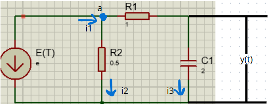

# Modelamiento de sistemas eléctricos RLC
### Nestor Alexander Avila Rojas, Leslie Stephania Rodriguez Marín
## 1. Introducción
En el estudio de sistemas dinámicos, modelar circuitos eléctricos es fundamental para comprender cómo responden ante diferentes estímulos en el tiempo. Esta clase se centró en el análisis de circuitos utilizando las leyes de Kirchhoff, que permiten establecer las ecuaciones diferenciales que describen el comportamiento dinámico de corrientes y tensiones en el sistema.

A través de la identificación de elementos como resistencias, inductancias y capacitancias, y del reconocimiento de las variables de entrada y salida del circuito, se puede representar matemáticamente su evolución. Este tipo de modelado es esencial para predecir el comportamiento del sistema ante diversas condiciones iniciales y entradas, facilitando el diseño y control de sistemas eléctricos en aplicaciones reales.

Comprender estos principios no solo permite resolver circuitos, sino también visualizar su dinámica como parte integral de un sistema físico, donde la energía se almacena, disipa y transfiere.
## 2. Sistemas eléctricos
Los sistemas eléctricos analizan cómo evolucionan los circuitos eléctricos complejos a lo largo del tiempo, considerando el impacto de factores internos y externos en su desempeño. Este estudio resulta especialmente importante en redes eléctricas, donde es fundamental mantener un flujo de energía continuo y seguro.
Los modelos de sistemas eñéctricos ayudan a simular y preveer cómo responden los sistemas eléctricos a cambios en la carga, generación, fallos y otras perturbaciones. Para ello se puede observar:

### 2.1 Estabilidad de tensión: 
Cómo el sistema mantiene niveles de tensión dentro de un rango aceptable frente a fluctuaciones en la demanda o generación.

### 2.2 Frecuencia de Operación: 
Las redes eléctricas deben operar a una frecuencia constante (por ejemplo, 50 o 60 Hz), y las variaciones pueden causar variaciones en el sistema.

### 2.3 Flujos de Potencia: 
Estudia la forma en que la energía se reparte dentro de una red eléctrica y cómo se puede optimizar su uso para reducir pérdidas y aumentar la eficiencia del sistema..

### 2.4 Control Automático y Respuesta a Contingencias:
Los sistemas eléctricos cuentan con dispositivos de control automático para ajustar tensión, frecuencia y flujo de potencia asegurando estabilidad en caso de fallas.

### 2.5 Dinámica de Generación y Demanda:
Evalúa cómo el sistema reacciona ante cambios en la generación de energía.
## 3. Ciruito RLC
>🔑 Un circuito RLC es un circuito eléctrico que está formado por resistencias inductancias y capacitancias estas a su vez están conectadas en serie o en paralelo también pueden ser circuitos mixtos son fundamentales para los sistemas de control filtrado de señales y otros circuitos electrónicos. Para la resolución de estos ejercicios es posible usar nodos, mallas, y demás teoremas de resolución de circuitos eléctricos.
>

Figura 1: Circuito RLC

Las redes RLC son circuitos eléctricos compuestos por tres elementos básicos, estos circuitos se rigen bajo la ley de ohm:

### 3.1 Resistor (R)
>🔑 Limita el flujo de corriente y disipa energía en forma de calor.

$$R=\frac{V(t)}{I(t)}$$

### 3.2 Inductor (L)
>🔑 Almacena energía en un campo magnético cuando la corriente fluye a través de él y se opone a cambios rápidos de corriente.

$$I= C\frac{dV(t)}{dt}$$
### 3.3 Capacitor (C)
>🔑Almacena energía en un campo eléctrico y se opone a cambios rápidos en el voltaje.

$$V= L\frac{di(t)}{dt}$$

#### 💡Ejemplo 1:

Figura 2: Ejemplo 1

Iniciaremos haciendo la suma de voltajes e igualando a cero:

$$V_i + V_R + V_L V_C = 0$$

Luego reemplazaremos las ecuaciones mostradas anteriormente en la ecuación.

$$V_i (t) + i(t)R + L\frac{di(t)}{dt} + V_C = 0$$

Una vez teniendo esto nos podemos dar cuenta que para que nos quede todo el factor es de voltaje del condensador reemplazaremos en la derivada de $i(t)$ por lo que vale $I$, teniendo la siguiente ecuación, que es la que modela el sistema:

$$-U(t)+RC\frac{\mathrm{d}V_{C}(t)}{\mathrm{d} t}+LC\frac{\mathrm{d^2}V_{C}(t)}{\mathrm{d}t^2}+V_{C}=0$$

### 💡Ejemplo 2:
Se desarrolla este ejemplo mediante nodos, tomando como referencia el nodo a:

Figura 3: Ejemplo 2

$$\sum I = 0$$

$$i_{u(t)} = i_1$$

$$i_{u(t)}+i_2+i_3=0$$

$$i_2 = \frac{a}{R2}$$

$$i_3 = C\dot{y}$$

$$a = R_1*i_3 + y(t)$$

Reemplazando:

$$i_{u(t)} - \frac{R_1*i_3 + y(t)}{R_2} -C\dot{y}=0$$

$$i_{u(t)} - \frac{1*i_3 + y(t)}{0.5} -2\dot{y}=0$$

## 4. Conclusiones
Las leyes de Kirchhoff son fundamentales en el modelamiento de sistemas eléctricos, ya que permiten establecer relaciones entre corrientes y tensiones dentro de un circuito, lo cual es esencial para comprender su comportamiento dinámico. Aplicarlas correctamente facilita el desarrollo de modelos matemáticos que describen cómo evoluciona un sistema a lo largo del tiempo.

Además, es crucial identificar adecuadamente las variables de entrada y salida del sistema para que el modelo represente fielmente su respuesta ante distintos estímulos. Esto se vuelve especialmente relevante en circuitos como los RLC y RC, donde la carga y la corriente varían en el tiempo debido a la presencia de elementos almacenadores de energía, como capacitores e inductores. Estos cambios influyen directamente en la estabilidad y el rendimiento del sistema eléctrico.
## 5. Referencias
Jorge Eduardo Cote Ballesteros. (2024). Sistemas eléctricos, dinámica de sistemas. ETITC

Ogata, Katsuhiko (1987) : Dinámica de Sistemas, Traducido de la primera edición en inglés de la obra System Dynamics, Prentice Hall Hispanoamericana, S.A., México.

Aprendizaje (UAPA) titulada Modelado de sistemas eléctricos y funciones de transferencia, desarrollada por el Sistema de Universidad Abierta y Educación a Distancia (SUAyED) de la Facultad de Estudios Superiores Cuautitlán de la UNAM:
suayed.cuautitlan.unam.mx
SUAyED FES Cuautitlán. (s.f.). Modelado de sistemas eléctricos y funciones de transferencia. Universidad Nacional Autónoma de México. Recuperado el 3 de mayo de 2025, de https://suayed.cuautitlan.unam.mx/uapas/2/
