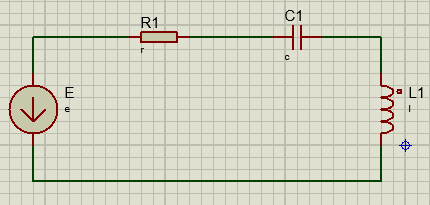

# Modelamiento de sistemas eléctricos e hidráulicos
### Nestor Alexander Avila Rojas, Leslie Stephania Rodriguez Marín
## 1. Introducción
En esta clase de sistemas dinámicos se exploraron dos áreas fundamentales del modelado físico: los amplificadores operacionales no inversores y los sistemas hidráulicos. En el caso de los amplificadores, se analizó cómo modelar su comportamiento dinámico mediante ecuaciones que relacionan la entrada con la salida, destacando la importancia de estos dispositivos en el procesamiento y control de señales dentro de sistemas electrónicos. Se identificaron las condiciones de ideales, así como los elementos que afectan su estabilidad.

Por otro lado, se introdujo el análisis de sistemas hidráulicos, donde se estudia el comportamiento del flujo y nivel de fluidos dentro de tanques.  Ambos enfoques permiten desarrollar una comprensión más amplia de cómo diferentes dominios físicos pueden representarse bajo marcos matemáticos similares, reforzando así la capacidad de análisis y diseño de sistemas dinámicos complejos.
## 2. Amplificador operacional NO inversor
Para determinar el modelamiento de un amplificador operacional no iversor es crucial tener en cuenta sus características:
+La tensión en ambas entradas del amplificador son iguales

+Las corrientes en las entradas del amplificador son nulas

+La impedancia de entrada es muy grande

+La impedancia de salida es muy pequeña (se asume que es 0)

La impedancia de entrada es rande para que el amplificador reciba una señal y toda la magnitud de la señal se quede en el amplificador, y la impedancia de salida es pequeña donde la mínima cantidad de tensión se quede en el amplificador.

El análisis de este modelo es mejor hacerlo por nodos.

Figura 1: Amplificador operacional

### 💡 Ejemplo 1:

Figura 2: Ejemplo 1

$$i_1-i_2=0$$

$$\frac{e_o-v_x}{R_2}-\frac{v_x-0}{R_1}=0$$

$$v_x = e_i$$

Reemplazando:

$$e_o = e_i(\frac{1}{R_2}+\frac{1}{R_1})R_2

### 💡 Ejemplo 2:

Figura 4: Ejemplo 2

$$i_1-i_2-i_3=0$$

$$\frac{e-e'}{R_1}-\frac{e'-e_o}{R_2}-C(\dot{e'}-\dot{e_o})=0$$

$$e'=0$$

Reemplazando:

$$\frac{e}{R_1}+\frac{e_o}{R_2}-C(-\dot{e_o})=0$$

$$\frac{e}{R_1}+\frac{e_o}{R_2}+C(\dot{e_o})=0$$

## 3. Sistemas hidráulicos
>🔑 Un circuito RLC es un circuito eléctrico que está formado por resistencias inductancias y capacitancias estas a su vez están conectadas en serie o en paralelo también pueden ser circuitos mixtos son fundamentales para los sistemas de control filtrado de señales y otros circuitos electrónicos. Para la resolución de estos ejercicios es posible usar nodos, mallas, y demás teoremas de resolución de circuitos eléctricos.
>

Figura 1: Circuito RLC

Las redes RLC son circuitos eléctricos compuestos por tres elementos básicos, estos circuitos se rigen bajo la ley de ohm:

## 4. Conclusiones
Las leyes de Kirchhoff son fundamentales en el modelamiento de sistemas eléctricos, ya que permiten establecer relaciones entre corrientes y tensiones dentro de un circuito, lo cual es esencial para comprender su comportamiento dinámico. Aplicarlas correctamente facilita el desarrollo de modelos matemáticos que describen cómo evoluciona un sistema a lo largo del tiempo.

Además, es crucial identificar adecuadamente las variables de entrada y salida del sistema para que el modelo represente fielmente su respuesta ante distintos estímulos. Esto se vuelve especialmente relevante en circuitos como los RLC y RC, donde la carga y la corriente varían en el tiempo debido a la presencia de elementos almacenadores de energía, como capacitores e inductores. Estos cambios influyen directamente en la estabilidad y el rendimiento del sistema eléctrico.
## 5. Referencias
Jorge Eduardo Cote Ballesteros. (2024). Sistemas eléctricos, dinámica de sistemas. ETITC

Jorge Eduardo Cote Ballesteros. (2024). Sistemas hidráulicos y térmicos, dinámica de sistemas. ETITC

Ogata, Katsuhiko (1987) : Dinámica de Sistemas, Traducido de la primera edición en inglés de la obra System Dynamics, Prentice Hall Hispanoamericana, S.A., México.

